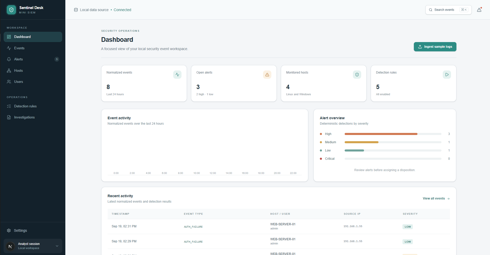
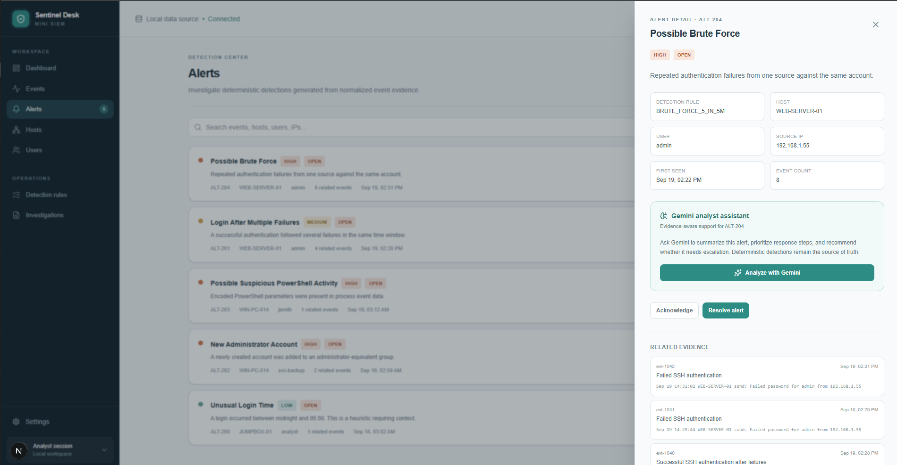

# Sentinel Desk

Sentinel Desk is a local-first mini SIEM for exploring normalized security events, deterministic detections, and analyst workflows. It provides a focused dashboard for events, alerts, hosts, users, detection rules, and investigations.

## Screenshots

### Dashboard



### Alert detail and AI assistant

The alert detail view shows the seeded brute-force detection, related evidence, and the integrated AI action without running it. Detection and alert generation remain deterministic; Gemini provides analyst assistance for alert review.



## Features

- Local SQLite workspace with automatic schema creation and seed data.
- Normalized event and alert views with search and severity filtering.
- Alert detail drawer with related evidence and status updates.
- Deterministic rules for brute force, login-after-failures, new admin accounts, encoded PowerShell, and unusual login times.
- Upload support for `.log`, `.json`, and `.csv` files.
- Gemini-powered alert summaries and response recommendations.

## Requirements

- Node.js 20.9 or newer
- pnpm 12 or a compatible pnpm version

## Getting started

```bash
pnpm install
pnpm dev
```

Open [http://localhost:3000](http://localhost:3000).

The first request creates `data/siem.db` and seeds the workspace from `lib/siem-data.ts`. The `data/` directory is ignored by Git because it contains local runtime state.

## Gemini configuration

Create `.env.local` and add a Gemini API key:

```env
GEMINI_API_KEY=your_key_here
```

Open an alert, then choose **Analyze with Gemini**. The deterministic detections remain available while the Gemini key or provider quota is unavailable.

## Uploading logs

Use **Ingest sample logs** on the dashboard or the upload dialog to add a `.log`, `.json`, or `.csv` file. Uploaded records are parsed into normalized events and stored in the local SQLite workspace. Files are treated as data and are never executed.

## Scripts

```bash
pnpm dev      # Start the development server
pnpm build    # Create a production build
pnpm start    # Serve the production build
```

## Project structure

```text
app/                 Next.js routes, pages, and API handlers
components/          SIEM shell, workspace views, and AI assistant
lib/siem-data.ts     Seed events, alerts, and detection rules
lib/db/              SQLite client and repository
public/               Static assets and README screenshots
```
